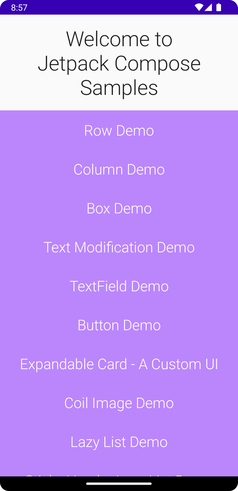

# Jetpack Compose Sample

Things covered-

* Row
* Column
* Box
* Text modification
* Text selection
* BaselineShift (Superscript/Subscript)
* Custom View (Expandable card)
* TextFields (BasicTextField, TextField, OutlinedTextField with character limit)
* Coil image loading library
* Password TextField
* Gradient Button (A custom button)
* LazyColumn (equivalent to RecyclerView with vertical scroll)
* LazyColumn with sticky header section (Experimental API)
* Curcular progress UI (Custom composable)
* Navigation using jetpack compose (with mandatory and optional arguments)
* Nested Navigation
* Bottom navigation

Live template shortcuts-
* comp - create a composable function

  
